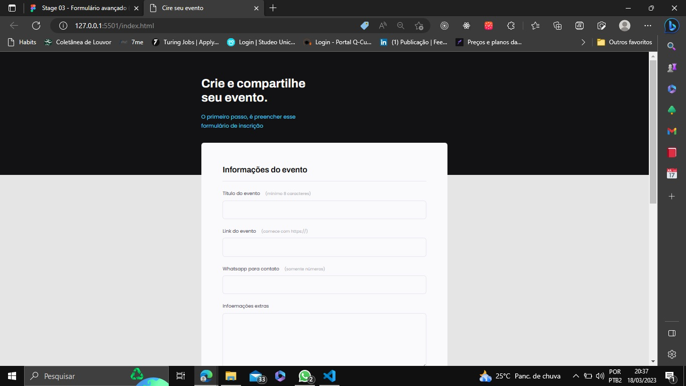

<h1 align="center"> Treine.me </h1>

Projeto do explorer 10, construimos um formulario  
<a href="https://www.rocketseat.com.br/explorer">Connheça o Explorer.</a>

  <a href="#-tecnologias">Tecnologias</a>&nbsp;&nbsp;&nbsp;|&nbsp;&nbsp;&nbsp;
  <a href="#-projeto">Projeto</a>&nbsp;&nbsp;&nbsp;|&nbsp;&nbsp;&nbsp;
  <a href="#-layout">Layout</a>&nbsp;&nbsp;&nbsp;|&nbsp;&nbsp;&nbsp;
  <a href="#memo-licença">Licença</a>

  

 

  

## 🚀 Tecnologias

Esse projeto foi desenvolvido com as seguintes tecnologias:

- HTML
- CSS
- Git e Github
- Figma

## 💻 Projeto
Criamos uma página web com um formulario de cadatrar eventos, com data dia e hora do evento.

- [Acesse o projeto finalizado, online](https://erlanmarinho.github.io/explrorerFlutuar/)

## :memo: Licença

Esse projeto está sob a licença MIT.

---

Feito com ♥ by Rocketseat :wave: [Participe da nossa comunidade!](https://discord.gg/rocketseat)
